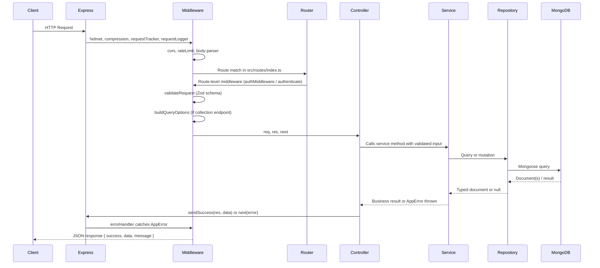
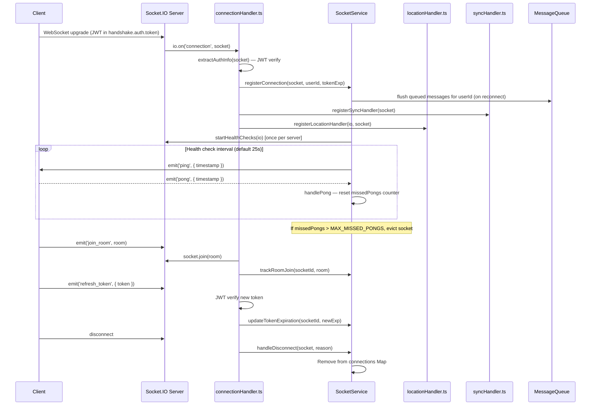
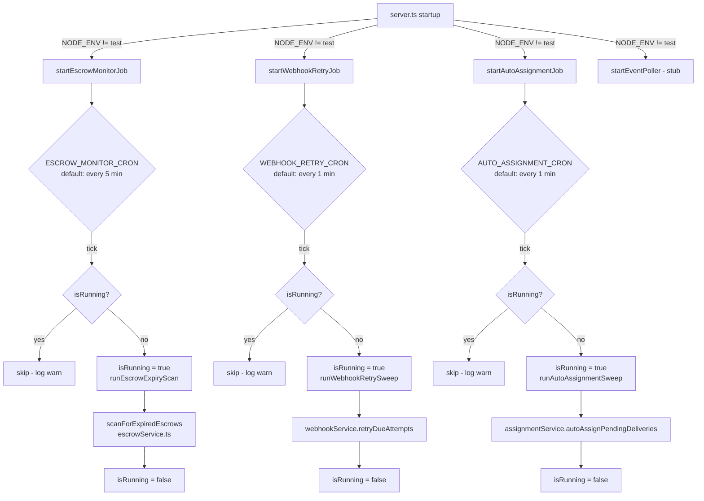
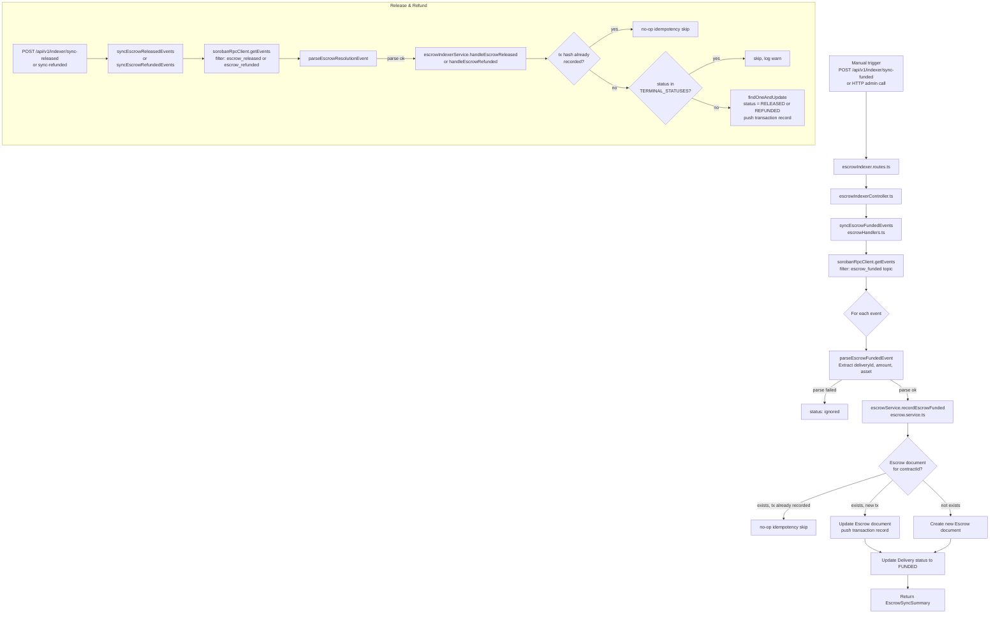

# SwiftChain Backend — Architecture Overview

> **Issue:** [Docs] Create an architecture overview document with layer diagrams and execution flow  
> **Closes #188**  
> **Branch:** `docs/architecture-overview`  
> **Last updated:** 2026-09-27

---

## Table of Contents

1. [Architecture Overview](#1-architecture-overview)
2. [Project Structure](#2-project-structure)
3. [Layer Responsibilities](#3-layer-responsibilities)
   - 3.1 [Controllers](#31-controllers)
   - 3.2 [Services](#32-services)
   - 3.3 [Repositories](#33-repositories)
   - 3.4 [Models](#34-models)
   - 3.5 [Middleware](#35-middleware)
4. [Dependency Injection Container](#4-dependency-injection-container)
5. [Repository Layer](#5-repository-layer)
6. [HTTP Request Lifecycle](#6-http-request-lifecycle)
7. [Socket.IO Connection Lifecycle](#7-socketio-connection-lifecycle)
8. [Cron / Job Execution Flow](#8-cron--job-execution-flow)
9. [Stellar / Soroban Event Ingestion Flow](#9-stellar--soroban-event-ingestion-flow)
10. [Deprecated / Legacy Implementations](#10-deprecated--legacy-implementations)
11. [Domain Glossary](#11-domain-glossary)

---

## 1. Architecture Overview

SwiftChain Backend is a **Node.js + Express.js + TypeScript** monolith that serves as the
central hub of the SwiftChain logistics platform. It connects three distinct consumers:

| Consumer | Protocol | Description |
|---|---|---|
| **SwiftChain_Frontend** (Next.js) | REST + WebSocket | End-user web application |
| **SwiftChain_SmartContract** (Stellar Soroban) | Soroban RPC polling | On-chain escrow contracts |
| **Internal background jobs** | In-process cron | Monitoring, auto-assignment, webhook retries |

The backend is designed with a strict dependency direction: requests flow from the transport layer
inward, and database access only occurs through the repository layer.

```
┌─────────────────────────────────────────────────────────────────┐
│                    SwiftChain Backend                           │
│                                                                 │
│  ┌──────────────┐   ┌──────────────┐   ┌──────────────────┐    │
│  │  HTTP/REST   │   │  Socket.IO   │   │  Background Jobs │    │
│  │  (Express)   │   │  (WS/Poll)   │   │  (node-cron)     │    │
│  └──────┬───────┘   └──────┬───────┘   └────────┬─────────┘    │
│         │                  │                     │              │
│  ┌──────▼───────────────────▼─────────────────────▼─────────┐  │
│  │              Controllers / Socket Handlers                │  │
│  └──────────────────────────┬────────────────────────────────┘  │
│                             │                                   │
│  ┌──────────────────────────▼────────────────────────────────┐  │
│  │                     Services Layer                        │  │
│  └──────────────────────────┬────────────────────────────────┘  │
│                             │                                   │
│  ┌──────────────────────────▼────────────────────────────────┐  │
│  │                  Repositories Layer                       │  │
│  └──────────────────────────┬────────────────────────────────┘  │
│                             │                                   │
│  ┌──────────────────────────▼────────────────────────────────┐  │
│  │            MongoDB via Mongoose Models                    │  │
│  └───────────────────────────────────────────────────────────┘  │
│                                                                 │
│  ┌───────────────────────────────────────────────────────────┐  │
│  │            External Integrations                          │  │
│  │  Stellar/Soroban RPC │ Redis │ Cloudinary/S3 │ FCM        │  │
│  └───────────────────────────────────────────────────────────┘  │
└─────────────────────────────────────────────────────────────────┘
```

**Key principles:**

- **Dependency Injection** — Awilix container bootstraps all singletons at startup and wires
  them into controllers and services. No component `import`s another component directly from
  within request-handling code.
- **Repository pattern** — `BaseRepository<T>` is the only layer permitted to call Mongoose
  model methods. Services never import a model directly.
- **Idempotent indexer** — Soroban event handlers guard against duplicate processing using
  transaction-hash checks before writing to MongoDB.
- **Graceful shutdown** — SIGTERM/SIGINT drain in-flight requests, stop cron jobs, close
  Socket.IO, and disconnect Redis before calling `process.exit`.

---

## 2. Project Structure

```
SwiftChain_Backend/
├── docs/                          # Architecture and reference documentation
│   └── architecture.md            # ← this file
├── src/
│   ├── app.ts                     # Express application factory
│   ├── server.ts                  # HTTP server entry point, job bootstrap
│   ├── seed.ts                    # Data seeding script
│   │
│   ├── config/                    # Environment, DB, Redis, Stellar, logger config
│   │   ├── database.ts            # MongoDB connection (Mongoose)
│   │   ├── env.ts                 # Zod-validated environment variables
│   │   ├── escrow.ts              # Escrow indexer configuration
│   │   ├── logger.ts              # Winston logger instance
│   │   ├── redis.ts               # Redis client + Redlock distributed locking
│   │   ├── security.ts            # CORS, helmet, rate-limit config helpers
│   │   └── stellar.ts             # Stellar/Soroban RPC client
│   │
│   ├── di/                        # Awilix dependency injection container
│   │   ├── container.ts           # Container factory + registration
│   │   ├── index.ts               # getContainer() export
│   │   └── tokens.ts              # Symbolic token constants
│   │
│   ├── models/                    # Mongoose schemas and document interfaces
│   │   ├── Delivery.ts            # Primary delivery model (IDelivery)
│   │   ├── Escrow.ts              # Escrow model (IEscrow, EscrowStatus)
│   │   ├── User.ts                # User model with roles
│   │   ├── DriverProfile.ts       # Driver-specific profile data
│   │   ├── Fleet.ts               # Fleet organization model
│   │   ├── FleetInvitation.ts     # Fleet invite records
│   │   ├── Dispute.ts             # Dispute records
│   │   ├── Evidence.ts            # Evidence attached to disputes
│   │   ├── EventLog.ts            # Indexer event checkpoints
│   │   ├── IndexerStatus.ts       # Per-network indexer ledger checkpoints
│   │   ├── IndexerAlert.ts        # Indexer lag alerts
│   │   ├── DlqEntry.ts            # Dead Letter Queue entries
│   │   ├── IdempotencyRecord.ts   # Idempotency key records
│   │   ├── Notification.ts        # User notification documents
│   │   ├── NotificationPreference.ts  # Per-user notification settings
│   │   ├── DriverLocation.ts      # Driver location history
│   │   ├── LocationUpdate.ts      # Real-time location update documents
│   │   ├── AuditLog.ts            # Audit trail
│   │   ├── WebhookSubscription.ts # Registered webhook endpoints
│   │   ├── WebhookDeliveryAttempt.ts  # Webhook delivery attempt records
│   │   ├── ChatMessage.ts         # Chat messages between users
│   │   └── deliveryModel.ts       # ⚠ DEPRECATED — DeliveryLegacy model
│   │
│   ├── repositories/              # Data access layer (extends BaseRepository)
│   │   ├── BaseRepository.ts      # Generic Mongoose-backed CRUD + pagination
│   │   ├── DeliveryRepository.ts  # Delivery-specific queries
│   │   ├── EscrowRepository.ts    # Escrow-specific queries
│   │   ├── UserRepository.ts      # User-specific queries
│   │   ├── NotificationRepository.ts
│   │   ├── NotificationPreferenceRepository.ts
│   │   ├── ChatMessageRepository.ts
│   │   ├── types.ts               # IRepository interface, Page<T>, ReadOptions
│   │   └── index.ts               # Re-exports
│   │
│   ├── services/                  # Business logic layer
│   │   ├── authService.ts         # JWT generation, verification, user auth
│   │   ├── delivery.service.ts    # Full delivery CRUD, state machine, webhooks
│   │   ├── deliveryService.ts     # ⚠ DEPRECATED — ETA + QR code only
│   │   ├── escrow.service.ts      # Escrow funded/release/refund (indexer ops)
│   │   ├── escrowService.ts       # ⚠ DEPRECATED/STUBBED — expiry scan (commented out)
│   │   ├── escrowIndexerService.ts    # Idempotent release/refund DB updates
│   │   ├── escrowMonitorService.ts    # Thin wrapper for escrowMonitor job
│   │   ├── assignmentService.ts   # Driver auto-assignment algorithm
│   │   ├── driverService.ts       # Driver profile management
│   │   ├── driverLocationService.ts   # Real-time driver location
│   │   ├── driverEarningsService.ts   # Driver earnings calculations
│   │   ├── fleetService.ts        # Fleet CRUD and member management
│   │   ├── adminService.ts        # Admin user/platform management
│   │   ├── disputeService.ts      # Dispute lifecycle management
│   │   ├── evidenceService.ts     # Evidence upload/retrieval
│   │   ├── notificationService.ts # Push + in-app notifications
│   │   ├── proofOfDeliveryService.ts  # Proof of delivery upload
│   │   ├── bulkDeliveryService.ts # CSV bulk import of deliveries
│   │   ├── webhookService.ts      # Webhook dispatch + retry logic
│   │   ├── transactionService.ts  # Soroban XDR transaction builder
│   │   ├── stellarService.ts      # Low-level Stellar SDK operations
│   │   ├── indexerService.ts      # Indexer status queries
│   │   ├── monitorService.ts      # Indexer lag monitoring
│   │   ├── idempotency.service.ts # Idempotency key store
│   │   ├── routingService.ts      # ETA routing calculations (Haversine/OSRM)
│   │   ├── etaCacheService.ts     # Redis-backed ETA result cache
│   │   ├── eventLogService.ts     # Event log CRUD
│   │   ├── storage.service.ts     # Cloudinary / S3 / local file storage
│   │   ├── profilePicture.service.ts  # Profile picture upload
│   │   ├── dashboardService.ts    # Admin dashboard aggregations
│   │   ├── socketMetricsService.ts    # Socket.IO connection metrics
│   │   ├── gracefulShutdownService.ts # Graceful shutdown helper
│   │   ├── dlqService.ts          # Dead Letter Queue management
│   │   ├── eventPoller.ts         # ⚠ STUB — event polling placeholder
│   │   ├── healthService.ts       # System health checks
│   │   └── push/                  # Push notification providers
│   │       ├── pushProvider.ts    # Provider interface
│   │       └── fcmProvider.ts     # Firebase Cloud Messaging implementation
│   │
│   ├── controllers/               # HTTP request handlers
│   │   ├── delivery.controller.ts # Canonical delivery controller (CRUD + ETA, uses delivery.service.ts)
│   │   ├── deliveryController.ts  # ⚠ DEPRECATED — compatibility shim re-exporting delivery.controller.ts
│   │   ├── deliveryStatusController.ts # Status transitions
│   │   ├── escrow.controller.ts   # Escrow by delivery/contract + fund trigger
│   │   ├── escrowController.ts    # ⚠ DEPRECATED — admin flagged escrows
│   │   ├── escrowIndexerController.ts  # Manual indexer sync triggers
│   │   ├── authController.ts      # Register, login, token management
│   │   ├── userController.ts      # User profile management
│   │   ├── driverController.ts    # Driver profile operations
│   │   ├── driverLocationController.ts # Driver location updates
│   │   ├── driverEarningsController.ts # Driver earnings queries
│   │   ├── fleetController.ts     # Fleet management
│   │   ├── adminController.ts     # Admin operations
│   │   ├── assignmentController.ts    # Driver assignment
│   │   ├── disputeController.ts   # Dispute lifecycle
│   │   ├── transactionController.ts   # Soroban XDR transaction builder
│   │   ├── stellar.controller.ts  # Stellar account operations
│   │   ├── proofOfDeliveryController.ts   # Proof of delivery upload
│   │   ├── bulkDeliveryController.ts  # CSV bulk import
│   │   ├── uploadController.ts    # General file upload
│   │   ├── notificationController.ts  # Notification preferences/list
│   │   ├── profileController.ts   # User profile picture
│   │   ├── dashboardController.ts # Admin dashboard aggregations
│   │   ├── webhookController.ts   # Webhook subscriptions
│   │   ├── healthController.ts    # Health check endpoint
│   │   ├── monitorController.ts   # Indexer monitoring endpoint
│   │   ├── socketMetricsController.ts  # Socket metrics endpoint
│   │   ├── eventLogController.ts  # Event log endpoint
│   │   ├── indexerController.ts   # Indexer status (legacy)
│   │   ├── indexer.controller.ts  # Indexer status (new)
│   │   ├── dlqController.ts       # Dead Letter Queue endpoint
│   │   └── circuitBreakerController.ts  # Circuit breaker status
│   │
│   ├── routes/                    # Express Router definitions
│   │   ├── index.ts               # Central router mounting all sub-routers
│   │   ├── delivery.routes.ts     # Full delivery CRUD (primary)
│   │   ├── delivery.ts            # ⚠ DEPRECATED — old delivery CRUD
│   │   ├── deliveryRoutes.ts      # ETA route
│   │   ├── deliveries.ts          # ⚠ DEPRECATED — status update using legacy middleware
│   │   ├── escrow.routes.ts       # Escrow by delivery/contract
│   │   ├── escrowRoutes.ts        # ⚠ DEPRECATED — admin flagged escrows
│   │   ├── escrowIndexer.routes.ts    # Manual indexer sync triggers
│   │   ├── authRoutes.ts          # Authentication
│   │   ├── userRoutes.ts          # User profile
│   │   ├── driverRoutes.ts        # Driver operations
│   │   ├── fleetRoutes.ts         # Fleet management
│   │   ├── adminRoutes.ts         # Admin operations
│   │   ├── bulkDeliveryRoutes.ts  # Bulk delivery import
│   │   ├── assignmentRoutes.ts    # Driver assignment
│   │   ├── disputeRoutes.ts       # Dispute operations
│   │   ├── transactionRoutes.ts   # Soroban XDR transactions
│   │   ├── stellar.routes.ts      # Stellar operations
│   │   ├── proofOfDeliveryRoutes.ts   # Proof of delivery
│   │   ├── uploadRoutes.ts        # File uploads
│   │   ├── profileRoutes.ts       # Profile picture
│   │   ├── notificationRoutes.ts  # Notifications
│   │   ├── webhookRoutes.ts       # Webhook subscriptions
│   │   ├── healthRoutes.ts        # Health check
│   │   ├── monitorRoutes.ts       # Indexer monitoring
│   │   ├── socketMetricsRoutes.ts # Socket metrics
│   │   ├── eventLogRoutes.ts      # Event logs
│   │   ├── indexer.routes.ts      # Indexer status (new)
│   │   ├── indexerRoutes.ts       # Indexer status (legacy)
│   │   └── dashboardService.ts    # Admin dashboard
│   │
│   ├── middlewares/               # Active middleware (current)
│   │   ├── authMiddleware.ts      # Stateless JWT decode (attaches JwtPayload)
│   │   ├── socketAuth.ts          # JWT + DB user lookup for Socket.IO connections
│   │   ├── queryMiddleware.ts     # buildQueryOptions — pagination/filter/sort parser
│   │   ├── rateLimiter.ts         # authLimiter + apiLimiter (express-rate-limit)
│   │   ├── idempotency.ts         # requireIdempotencyKey middleware
│   │   └── validateRequest.ts     # Zod schema validation (updated version)
│   │
│   ├── middleware/                # ⚠ DEPRECATED — legacy middleware directory
│   │   ├── auth.ts                # Simple stateless JWT + inline role check
│   │   ├── authenticate.ts        # DB-backed JWT middleware (loads full User doc)
│   │   ├── validate.ts            # Zod validation (original)
│   │   ├── requireRole.ts         # Role-based access control
│   │   ├── errorHandler.ts        # Global Express error handler
│   │   ├── requestLogger.ts       # Winston request logging
│   │   └── requestTracker.ts      # In-flight request tracking for graceful shutdown
│   │
│   ├── sockets/                   # WebSocket implementation
│   │   ├── connectionHandler.ts   # Active: TypedServer factory + per-socket lifecycle
│   │   ├── socket.service.ts      # Active: SocketService — connection registry + health checks
│   │   ├── socket.types.ts        # Typed event interfaces (ServerToClientEvents, etc.)
│   │   ├── locationHandler.ts     # Real-time driver location broadcast
│   │   ├── location.service.ts    # Location business logic
│   │   ├── syncHandler.ts         # Offline message sync on reconnect
│   │   ├── sync.service.ts        # Sync service
│   │   ├── messageQueue.ts        # In-memory queued messages for offline users
│   │   ├── chatMessage.service.ts # Chat message persistence
│   │   ├── socketController.ts    # socketController used by legacy initSocket
│   │   ├── socketService.ts       # Legacy socketService helper
│   │   └── index.ts               # ⚠ DEPRECATED — initSocket on /api/v1/realtime namespace
│   │
│   ├── jobs/                      # Background cron jobs
│   │   ├── escrowMonitor.ts       # Escrow expiry scan (node-cron)
│   │   ├── autoAssignmentJob.ts   # Driver auto-assignment sweep
│   │   └── webhookRetryJob.ts     # Failed webhook delivery retry
│   │
│   ├── indexer/                   # Soroban event indexer
│   │   ├── escrowHandlers.ts      # Parse + handle escrow_funded/released/refunded
│   │   ├── deliveryHandlers.ts    # Delivery on-chain event handlers
│   │   ├── disputeHandlers.ts     # Dispute on-chain event handlers
│   │   ├── reputationHandlers.ts  # Reputation on-chain event handlers
│   │   └── types/
│   │       └── escrowEvents.ts    # EscrowResolvedEvent type definitions
│   │
│   ├── blockchain/
│   │   └── soroban.service.ts     # Soroban contract invocation (getLatestLedger, etc.)
│   │
│   ├── validators/                # Zod validation schemas
│   │   ├── authValidator.ts
│   │   ├── deliveryValidator.ts
│   │   ├── escrowValidator.ts
│   │   ├── disputeValidator.ts
│   │   ├── transactionValidator.ts
│   │   ├── webhookValidator.ts
│   │   └── userValidator.ts
│   │
│   ├── utils/                     # Utility functions
│   │   ├── responseWrapper.ts     # sendSuccess / sendError helpers
│   │   ├── asyncHandler.ts        # Async route handler wrapper
│   │   ├── AppError.ts            # Custom error class
│   │   ├── ApiError.ts            # API-specific error class
│   │   ├── circuitBreaker.ts      # Circuit breaker for external calls
│   │   ├── rpcRetry.ts            # Stellar RPC retry with backoff
│   │   ├── xdrParser.ts           # Stellar XDR parsing utilities
│   │   ├── stroops.ts             # Stellar stroops/XLM conversion
│   │   ├── qrToken.ts             # QR code token generation
│   │   ├── etaCacheKey.ts         # ETA cache key builder
│   │   ├── geohash.ts             # Geohash utilities
│   │   ├── csvParser.ts           # CSV parsing for bulk import
│   │   ├── piiMasker.ts           # PII masking for logs
│   │   └── dateUtils.ts           # Date/time helpers
│   │
│   ├── types/                     # TypeScript type definitions
│   │   ├── query.ts               # QueryOptions, PaginationMeta, FilterableFieldType
│   │   ├── health.types.ts        # Health check types
│   │   └── routing.types.ts       # Routing/ETA types
│   │
│   ├── interfaces/                # TypeScript interfaces for domain objects
│   │   ├── IUser.ts               # IUser, UserRole enum
│   │   ├── IDriverProfile.ts      # IDriverProfile
│   │   └── IFleet.ts              # IFleet
│   │
│   └── errors/
│       └── AppError.ts            # AppError base class (separate from utils/AppError.ts)
│
├── tests/                         # Jest unit + integration tests
├── load-tests/                    # k6 + Socket.IO load tests
├── src/docs/swagger.ts            # Swagger/OpenAPI specification
├── package.json
├── tsconfig.json
├── docker-compose.yml
├── Dockerfile
└── README.md
```

---

## 3. Layer Responsibilities

### 3.1 Controllers

Controllers are the HTTP boundary. They:

- Receive validated `Request` objects from Express.
- Parse and validate path params, query strings, and request bodies.
- Call one or more **services** to execute business logic.
- Format responses using `sendSuccess` / `sendError` helpers from `utils/responseWrapper.ts`.
- Never interact with Mongoose models directly (all data access goes through services → repositories).
- Are instantiated as module-level singletons and registered in the Awilix DI container.

Controllers in this codebase follow a class-based pattern with instance methods bound to `this`:

```typescript
// Example: src/controllers/escrow.controller.ts
export class EscrowController {
  async getByDelivery(req: Request, res: Response, next: NextFunction): Promise<void> {
    try {
      const escrow = await escrowService.getByDeliveryId(req.params.deliveryId);
      sendSuccess(res, escrow, 'Escrow retrieved successfully', httpStatus.OK);
    } catch (error) {
      next(error);
    }
  }
}
export const escrowController = new EscrowController();
```

### 3.2 Services

Services contain all business logic. They:

- Enforce domain rules (e.g., delivery state machine transitions in `delivery.service.ts`).
- Coordinate across multiple repositories or external systems.
- Emit notifications and webhooks when side effects are needed.
- Are the only layer permitted to acquire distributed locks (via `withLock` from `config/redis.ts`).
- Are instantiated as module-level singletons.

Key services and their responsibilities:

| Service | File | Responsibility |
|---|---|---|
| `AuthService` | `authService.ts` | JWT generation, verification, user lookup |
| `DeliveryService` (active) | `delivery.service.ts` | Full delivery CRUD, state machine, notifications, webhooks |
| `EscrowService` (active) | `escrow.service.ts` | `recordEscrowFunded`, `releaseEscrow` (idempotent indexer ops) |
| `EscrowIndexerService` | `escrowIndexerService.ts` | Idempotent `handleEscrowReleased`, `handleEscrowRefunded` |
| `AssignmentService` | `assignmentService.ts` | Nearest available driver assignment algorithm |
| `FleetService` | `fleetService.ts` | Fleet CRUD, membership management |
| `DisputeService` | `disputeService.ts` | Dispute lifecycle (open → under_review → resolved) |
| `WebhookService` | `webhookService.ts` | Fanout to registered webhooks, retry on failure |
| `NotificationService` | `notificationService.ts` | Push + in-app notification dispatch (FCM) |
| `TransactionService` | `transactionService.ts` | Build unsigned Soroban XDR for client-side signing |
| `StellarService` | `stellarService.ts` | Stellar SDK: account info, transaction submission |
| `RoutingService` | `routingService.ts` | ETA calculations via Haversine or OSRM |
| `DlqService` | `dlqService.ts` | Dead Letter Queue entry management |
| `MonitorService` | `monitorService.ts` | Indexer lag detection and alerting |

### 3.3 Repositories

Repositories are the only layer that imports Mongoose models and executes queries. They:

- Extend `BaseRepository<T>` which provides generic CRUD, pagination, and soft-delete support.
- Add domain-specific query methods (e.g., `findByTrackingNumber`, `transitionStatus`).
- Accept `ReadOptions<T>` and `WriteOptions` for projection, sorting, population, and sessions.
- Guard against Mongoose `CastError` by validating ObjectIds before calling Mongoose — invalid
  IDs return `null` / `false` rather than throwing.

Available concrete repositories:

| Repository | Model |
|---|---|
| `DeliveryRepository` | `Delivery` |
| `EscrowRepository` | `Escrow` |
| `UserRepository` | `User` |
| `NotificationRepository` | `Notification` |
| `NotificationPreferenceRepository` | `NotificationPreference` |
| `ChatMessageRepository` | `ChatMessage` |

### 3.4 Models

Mongoose models define the MongoDB schemas, document types, and any document-level methods.

Key models:

| Model | Collection | Notable Features |
|---|---|---|
| `Delivery` | `deliveries` | Soft-delete (`isDeleted`, `deletedAt`, `deletedBy`); compound indexes on `status + createdAt`; `DeliveryStatus` enum |
| `Escrow` | `escrows` | `EscrowStatus` enum; `isFundsLocked` and `isSettled` virtuals; embedded `transactions[]` array; unique index on `transactions.hash` |
| `User` | `users` | Role-based (`UserRole`); `status` field (`active`, `suspended`, `banned`) |
| `Fleet` | `fleets` | `members[]` with per-member `role`; Stellar `treasuryAddress`; pre-save hook adds owner to members |
| `IndexerStatus` | `indexerstatuses` | One document per network; tracks `lastProcessedLedger` |
| `DlqEntry` | `dlqentries` | `DlqStatus` (`pending`, `retried`, `resolved`); `retryCount` |
| `IdempotencyRecord` | `idempotencyrecords` | `status` (`processing`, `completed`, `failed`); cached response body |
| `EventLog` | `eventlogs` | Indexer event type checkpoints |

### 3.5 Middleware

The middleware stack executes in this order for a typical authenticated REST request:

1. **`helmet()`** — Security headers (from npm `helmet`).
2. **`compression()`** — Response gzip compression.
3. **`requestTracker`** (`src/middleware/requestTracker.ts`) — Counts in-flight requests; rejects new requests during graceful shutdown.
4. **`requestLogger`** (`src/middleware/requestLogger.ts`) — Winston request/response logging.
5. **`cors()`** — Cross-origin resource sharing configuration.
6. **`rateLimit()`** — Global API rate limiter (`100 req / 15 min` in production).
7. **`express.json()`** — Body parser (10 MB limit).
8. **Route-level middlewares** applied per-route as needed:
   - **`authMiddleware`** (`src/middlewares/authMiddleware.ts`) — Stateless JWT decode; attaches `JwtPayload` to `req.user`.
   - **`authenticate`** (`src/middleware/authenticate.ts`) — DB-backed JWT; loads full `User` document.
   - **`requireRole`** (`src/middleware/requireRole.ts`) — RBAC guard; must follow `authenticate`.
   - **`authLimiter`** (`src/middlewares/rateLimiter.ts`) — Stricter limit on auth endpoints (10 / 15 min).
   - **`validateRequest`** / **`validate`** — Zod schema validation of request bodies.
   - **`buildQueryOptions`** (`src/middlewares/queryMiddleware.ts`) — Parses `page`, `limit`, `sort`, `search`, and filter operators into `QueryOptions`.
   - **`requireIdempotencyKey`** (`src/middlewares/idempotency.ts`) — Enforces idempotency on mutating POST endpoints.
9. **`errorHandler`** (`src/middleware/errorHandler.ts`) — Global error handler; converts `AppError` / unhandled errors to JSON responses.

---

## 4. Dependency Injection Container

### Awilix

The container is built with **Awilix** (`src/di/container.ts`) using `InjectionMode.PROXY`. This
means each registrant receives a plain object (`cradle`) from which it destructures its
dependencies by name, without any decorator syntax.

Since all services and controllers in this codebase are pre-instantiated module-level singletons,
they are registered with `asValue(instance)` rather than `asClass(Constructor)`. This means Awilix
acts as a central registry for lookup and testing rather than as a lifecycle manager.

### Registrations

The container registers three categories of value:

| Category | Token examples | Source |
|---|---|---|
| **Config & Infrastructure** | `logger`, `env`, `redisClient` | `config/` modules |
| **Models** | `userModel`, `deliveryModel`, `escrowModel`, … | Mongoose model objects |
| **Services** | `authService`, `deliveryService`, `escrowService`, … | Service singleton instances |
| **Controllers** | `authController`, `deliveryController`, `escrowController`, … | Controller singleton instances |

Token names are defined as string constants in `src/di/tokens.ts`:

```typescript
export const TOKENS = {
  authService: 'authService',
  delivery_service: 'delivery_service', // alternate name for delivery.service.ts
  escrow_service: 'escrow_service',      // alternate name for escrow.service.ts
  // ... (see tokens.ts for the full list)
} as const;
```

Parallel implementations (e.g., `deliveryService` vs `delivery_service`) are both registered
under their own token to support the transition between old and new implementations.

### Dependency Resolution

The container is a lazy singleton: `getContainer()` creates it once on first call and returns the
same instance for all subsequent calls. `resetContainer()` is available for test isolation.

```typescript
// src/app.ts — bootstrapped once at application startup
import { getContainer } from './di';
getContainer();
```

### Controller / Service Wiring

Routes access registered singletons by importing them directly from their module files. The
Awilix container is used primarily as a central registry (for introspection, testing, and future
per-request instantiation) rather than as the injection mechanism for runtime resolution in
route handlers.

---

## 5. Repository Layer

### BaseRepository

`src/repositories/BaseRepository.ts` is an **abstract generic class** that all concrete
repositories extend:

```typescript
export abstract class BaseRepository<T extends Document>
  implements IRepository<T> {
  protected constructor(protected readonly model: Model<T>) {}

  // Core operations:
  create(data, options?)           → Promise<T>
  createMany(data[], options?)     → Promise<T[]>
  findById(id, options?)           → Promise<T | null>
  findOne(filter, options?)        → Promise<T | null>
  find(filter, options?)           → Promise<T[]>
  paginate(filter, page, limit, options?)  → Promise<Page<T>>
  count(filter, options?)          → Promise<number>
  exists(filter, options?)         → Promise<boolean>
  updateById(id, update, options?) → Promise<T | null>
  updateOne(filter, update, options?) → Promise<T | null>
  deleteById(id, options?)         → Promise<boolean>
}
```

`ReadOptions<T>` supports `projection`, `sort`, `skip`, `limit`, `populate`, `session`, and
`lean`. `WriteOptions` supports `session` and `runValidators`.

The `paginate` method clamps `page ≥ 1` and `limit` within `[1, 100]` to prevent unbounded
result sets from hostile callers.

### Concrete Repositories

**`DeliveryRepository`** adds:

| Method | Description |
|---|---|
| `findByTrackingNumber(tn)` | Lookup by external tracking number |
| `trackingNumberExists(tn)` | Includes archived records to prevent reuse |
| `findExistingTrackingNumbers(tns[])` | Bulk duplicate detection for CSV import |
| `listPaginated(filter, page, limit)` | Translates `DeliveryQueryFilter` → Mongo query; supports `status`, `driverId`, `search` |
| `listArchived(page, limit)` | Lists soft-deleted deliveries |
| `findByIdIncludingArchived(id)` | Loads archived document for restore operations |
| `findByDriver(driverId)` | Deliveries assigned to a driver |
| `updateStatusByTrackingNumber(tn, status)` | Bypasses state-machine — used by on-chain event handler |
| `transitionStatus(id, from, to)` | Atomic CAS-style transition; returns `null` if not in `from` state |

**`EscrowRepository`** adds lookups by `delivery` ObjectId, `contractId`, and by `lockStatus`.

**`UserRepository`** adds lookups by email, Stellar public key, and active status.

### Mongoose Interaction

The repository is the **only** layer that calls Mongoose methods (`findById`, `findOne`,
`findByIdAndUpdate`, `create`, `insertMany`, `countDocuments`, etc.). Services import the
repository instance, never the model directly.

---

## 6. HTTP Request Lifecycle



**Key points:**

- Route definitions (`src/routes/index.ts`) mount all sub-routers under `/api/v1/`.
- Authentication is applied per-route, not globally. Routes that require the full User document
  use `authenticate` (`src/middleware/authenticate.ts`). Routes that only need the JWT payload
  use `authMiddleware` (`src/middlewares/authMiddleware.ts`).
- Idempotency-protected endpoints (typically `POST` mutations) include `requireIdempotencyKey`
  before the controller. Duplicate requests with the same key replay the cached response.
- The `errorHandler` (`src/middleware/errorHandler.ts`) is registered **last** in `app.ts` and
  handles both `AppError` instances and unexpected errors, always returning structured JSON.

---

## 7. Socket.IO Connection Lifecycle

The current Socket.IO implementation uses a **typed server** (`TypedServer`) defined in
`src/sockets/connectionHandler.ts`. The server attaches directly to the Node.js `http.Server`
instance created in `server.ts`.



**JWT expiry enforcement:** On each health-check tick, if the JWT stored in `socket.data.tokenExp`
is in the past, the server emits `auth_expired` and disconnects the client.

**Message queue:** `messageQueueService` holds events for offline users in memory. When a user
reconnects, `registerConnection` calls `messageQueueService.flush` to replay queued messages
immediately.

**Graceful shutdown flow:**

```
SIGTERM/SIGINT
  → stopHealthChecks()
  → io.disconnectSockets(true)
  → socketService.clearConnections()
  → io.close()
```

**Events:**

| Direction | Event | Description |
|---|---|---|
| Server → Client | `ping` | Health-check ping with timestamp |
| Server → Client | `auth_expired` | JWT has expired; client must re-authenticate |
| Server → Client | `delivery_status_updated` | Delivery status changed (from indexer) |
| Client → Server | `pong` | Response to `ping` |
| Client → Server | `join_room` | Subscribe to a named room |
| Client → Server | `leave_room` | Unsubscribe from a named room |
| Client → Server | `refresh_token` | Provide a new JWT to extend session |
| Client → Server | `message_ack` | Acknowledge receipt of a queued message |
| Client → Server | `location_update` | Real-time driver location (handled by locationHandler) |

---

## 8. Cron / Job Execution Flow

Three recurring background jobs are started in `server.ts` (guarded by `NODE_ENV !== 'test'`).
All three use **`node-cron`** and share an identical idempotency guard: a module-level `isRunning`
boolean prevents overlapping runs.



**Job details:**

| Job | File | Default cron | Calls | Description |
|---|---|---|---|---|
| Escrow Monitor | `jobs/escrowMonitor.ts` | `ESCROW_MONITOR_CRON` (5 min) | `escrowService.scanForExpiredEscrows` | Scans for escrows whose lock period has exceeded TTL and flags them |
| Webhook Retry | `jobs/webhookRetryJob.ts` | `WEBHOOK_RETRY_CRON` (1 min) | `webhookService.retryDueAttempts` | Retries failed webhook delivery attempts that are due for retry |
| Auto-Assignment | `jobs/autoAssignmentJob.ts` | `AUTO_ASSIGNMENT_CRON` (1 min) | `assignmentService.autoAssignPendingDeliveries` | Assigns nearest available drivers to funded, unassigned deliveries |

All cron expressions are configurable via environment variables. All jobs are stopped during
graceful shutdown by calling `stopXxx()` before the process exits.

**Note:** `startEventPoller` / `stopEventPoller` (`services/eventPoller.ts`) are stubs that only
log messages — the full polling implementation is not yet built.

---

## 9. Stellar / Soroban Event Ingestion Flow

The indexer polls the Soroban RPC node for smart contract events and persists their effects to
MongoDB. The design is **idempotent**: every event handler checks whether the transaction hash
has already been recorded before writing, so ledger ranges can be replayed safely.



**`IndexerStatus` model** stores `lastProcessedLedger` per network. The monitoring service
(`monitorService.ts`) compares this against the live network ledger fetched from the Soroban
RPC node to detect indexer lag and raise `IndexerAlert` documents when thresholds are exceeded.

**Dead Letter Queue (DLQ):** When a Stellar transaction fails (e.g., in `stellarService`), the
payload is written to `DlqEntry`. The admin can list DLQ entries and trigger a retry via
`dlqService.retryEntry`, which replays the payload through `stellarService.submitEscrowLock`.

**`eventPoller.ts`** is a **stub** (`startEventPoller` / `stopEventPoller` only log). A
continuous polling loop that advances `lastProcessedLedger` and feeds events to the handlers
is planned but not yet implemented.

---

## 10. Deprecated / Legacy Implementations

The following files are confirmed legacy or transitional implementations. They remain in the
codebase for backward compatibility and MUST NOT be deleted or modified without a dedicated
migration PR.

> **DEPRECATED** markers indicate files that should not be used for new feature development.

---

### 10.1 Middleware Directory Split

| Status | Directory | Description |
|---|---|---|
| **DEPRECATED** | `src/middleware/` | Original middleware — `auth.ts`, `authenticate.ts`, `validate.ts`, `requireRole.ts` |
| Active | `src/middlewares/` | Current middleware — `authMiddleware.ts`, `socketAuth.ts`, `queryMiddleware.ts`, `rateLimiter.ts`, `idempotency.ts`, `validateRequest.ts` |

Both `auth.ts` and `authenticate.ts` provide JWT authentication but differ in implementation:

- `src/middleware/auth.ts` — **DEPRECATED.** Stateless: decodes the JWT and attaches a
  `JwtPayload` to `req.user`. Does **not** load the User document from MongoDB.
- `src/middleware/authenticate.ts` — **DEPRECATED.** DB-backed: verifies the JWT and loads the
  full `User` document from MongoDB. Blocks suspended/banned accounts.

New routes should use the middleware in `src/middlewares/`.

---

### 10.2 Delivery: Parallel Implementations

#### Model

| Status | File | Mongoose model name | Schema |
|---|---|---|---|
| Active | `src/models/Delivery.ts` | `Delivery` | Full schema: `IDelivery` interface, `DeliveryStatus` enum (6 states), soft-delete methods, coordinates, proofOfDelivery, escrowAmount |
| **DEPRECATED** | `src/models/deliveryModel.ts` | `DeliveryLegacy` | Simplified schema: `customerName`, `pickupLocation`, `dropoffLocation`, `packageDetails`, `status` (5 states), `assignedDriver` |

#### Service

| Status | File | Class | Responsibilities |
|---|---|---|---|
| Active | `src/services/delivery.service.ts` | `DeliveryService` | Full CRUD with `DeliveryRepository`, state machine with `ALLOWED_TRANSITIONS`, notifications, webhooks |
| **DEPRECATED** | `src/services/deliveryService.ts` | `DeliveryService` | ETA calculation (`calculateDeliveryETA`) and handoff QR code generation only; uses `Delivery` model directly (bypasses repository) |

#### Controller

| Status | File | Usage |
|---|---|---|
| Active | `src/controllers/delivery.controller.ts` | Full delivery CRUD (incl. `GET /:id/eta`) via `delivery.service.ts` |
| **DEPRECATED** | `src/controllers/deliveryController.ts` | Compatibility shim — re-exports the canonical controller from `delivery.controller.ts` |

#### Routes

| Status | File | Endpoint |
|---|---|---|
| Active | `src/routes/delivery.routes.ts` | Full CRUD under `/api/v1/deliveries` |
| **DEPRECATED** | `src/routes/delivery.ts` | Old CRUD: `POST /`, `GET /`, `GET /:id`, `PUT /:id/assign` using `deliveryCrudController` exports |
| **DEPRECATED** | `src/routes/deliveries.ts` | `PUT /:id/status` using legacy `authenticate` + `authorize` from `src/middleware/auth.ts` |
| Active | `src/routes/deliveryRoutes.ts` | `GET /:id/eta` only |

---

### 10.3 Escrow: Parallel Implementations

| Status | File | Responsibilities |
|---|---|---|
| Active | `src/services/escrow.service.ts` | `recordEscrowFunded`, `releaseEscrow` — idempotent indexer operations with distributed locking |
| **DEPRECATED / STUBBED** | `src/services/escrowService.ts` | `scanForExpiredEscrows`, `getFlaggedEscrows`, `resolveEscrow` — expiry logic is **commented out** because `EscrowStatus.EXPIRED` and `expiresAt` are not yet in the model |

| Status | File | Usage |
|---|---|---|
| Active | `src/controllers/escrow.controller.ts` | Escrow by delivery/contract; triggers `recordEscrowFunded` |
| **DEPRECATED** | `src/controllers/escrowController.ts` | Admin flagged escrows using stubbed `escrowService.ts` functions |

| Status | File | Endpoint |
|---|---|---|
| Active | `src/routes/escrow.routes.ts` | `GET /delivery/:id`, `GET /contract/:id`, `POST /fund` |
| **DEPRECATED** | `src/routes/escrowRoutes.ts` | `GET /flagged`, `PATCH /:id/resolve` using legacy `authenticate` + `requireRole` |

---

### 10.4 Socket.IO: Parallel Implementations

| Status | File | Description |
|---|---|---|
| Active | `src/sockets/connectionHandler.ts` | `TypedServer` with typed events, JWT extraction, ping/pong health checks, offline message flush, token expiry enforcement |
| **DEPRECATED** | `src/sockets/index.ts` | `initSocket` using a named namespace `/api/v1/realtime`; authenticates via `socketAuth` middleware; delegates to `socketController` |

The active implementation (`connectionHandler.ts`) is the one started in `server.ts`. The
`initSocket` function in `sockets/index.ts` is not called from the current server entry point
but is retained for reference.

---

### 10.5 Indexer: Stub

| Status | File | Description |
|---|---|---|
| Stub | `src/services/eventPoller.ts` | `startEventPoller` and `stopEventPoller` only log messages; no polling logic is implemented |

---

## 11. Domain Glossary

### Escrow

A **escrow** is a financial hold recorded in the `Escrow` MongoDB collection, linked 1:1 to a
delivery. It represents funds locked in a Soroban smart contract on the Stellar network until the
delivery is completed or cancelled. The escrow lifecycle is:

```
pending → locked → released
               └→ refunded
               └→ disputed
```

- **`pending`** — Escrow document created but funds not yet on-chain.
- **`locked`** — An `escrow_funded` event was indexed; funds are held in the Soroban contract.
- **`released`** — An `escrow_released` event was indexed; funds were transferred to the payee.
- **`refunded`** — An `escrow_refunded` event was indexed; funds were returned to the payer.
- **`disputed`** — A dispute was raised against this delivery while the escrow was locked.

### Lock Status

**Lock status** is an alias for the current `EscrowStatus` of an escrow. The virtual property
`isFundsLocked` on the `Escrow` model returns `true` when `status` is `locked` or `disputed`
(i.e., the contract is actively holding the funds). The virtual `isSettled` returns `true` when
`status` is `released` or `refunded` (terminal states; no further transitions are possible).

The `EscrowLockStatus` enum exported from `src/models/Escrow.ts` is an alias of `EscrowStatus`
kept for backward compatibility with services that imported the old name.

### Proof of Delivery

**Proof of delivery (PoD)** is image evidence uploaded by the driver to confirm a package was
delivered. It is stored as an embedded `IProofOfDelivery` sub-document within the `Delivery`
document:

```typescript
interface IProofOfDelivery {
  storageKey: string;    // S3 key or local relative path
  imageUrl: string;      // Publicly accessible URL
  storageDriver: string; // 's3' | 'cloudinary' | 'local'
  mimeType: string;
  sizeBytes: number;
  uploadedBy: string;    // Driver user ID
  uploadedAt: Date;
}
```

The `proofOfDeliveryService` handles upload validation, storage provider selection
(Cloudinary, S3, or local), and linking the result back to the Delivery document.

### Fleet

A **fleet** is a logical grouping of drivers under a business or operator entity, stored in the
`Fleet` collection. Key properties:

- `ownerId` — The User who created and manages the fleet.
- `members[]` — Array of `{ userId, role, joinedAt }` where `role` is `admin`, `driver`, or
  `viewer`.
- `treasuryAddress` — A Stellar account address (G... format, 56 chars) that receives
  escrow payouts for fleet deliveries.
- `businessMetadata` — Company name, registration number, VAT, and contact details.

The `drivers` array field is retained for backward compatibility but membership is managed
through `members`.

### Indexer Ledger

The **indexer ledger** is the Stellar/Soroban ledger sequence number up to which the backend has
fully processed on-chain events. It is persisted in the `IndexerStatus` collection (one document
per network, e.g., `testnet`, `mainnet`):

```typescript
interface IIndexerStatus {
  network: string;              // 'testnet' | 'mainnet'
  lastProcessedLedger: number;  // Highest fully-processed ledger sequence
  lastProcessedAt: Date;        // When the ledger was last advanced
}
```

The `monitorService` compares `lastProcessedLedger` against the live network ledger
(fetched from Soroban RPC) to compute **indexer lag** in ledger sequences. When lag exceeds a
configured threshold, an `IndexerAlert` document is created and a notification is sent.

### DLQ (Dead Letter Queue)

The **Dead Letter Queue (DLQ)** captures Stellar transactions that failed during processing and
could not be retried inline. Entries are stored in the `DlqEntry` collection:

```typescript
interface IDlqEntry {
  payload: any;          // Original transaction payload
  errorReason: string;   // Error message from the failed attempt
  retryCount: number;    // Number of retry attempts so far
  status: DlqStatus;     // 'pending' | 'retried' | 'resolved'
}
```

`DlqService` provides:
- `addEntry(payload, errorReason)` — Creates a new DLQ entry.
- `listEntries(page, limit)` — Paginates entries for admin review.
- `retryEntry(id)` — Increments `retryCount`, re-submits the payload through
  `stellarService.submitEscrowLock`, and marks the entry `resolved` on success or
  `pending` on failure.

Admins can view and retry DLQ entries via `GET /api/v1/indexer/dlq` and
`POST /api/v1/indexer/dlq/:id/retry`.
